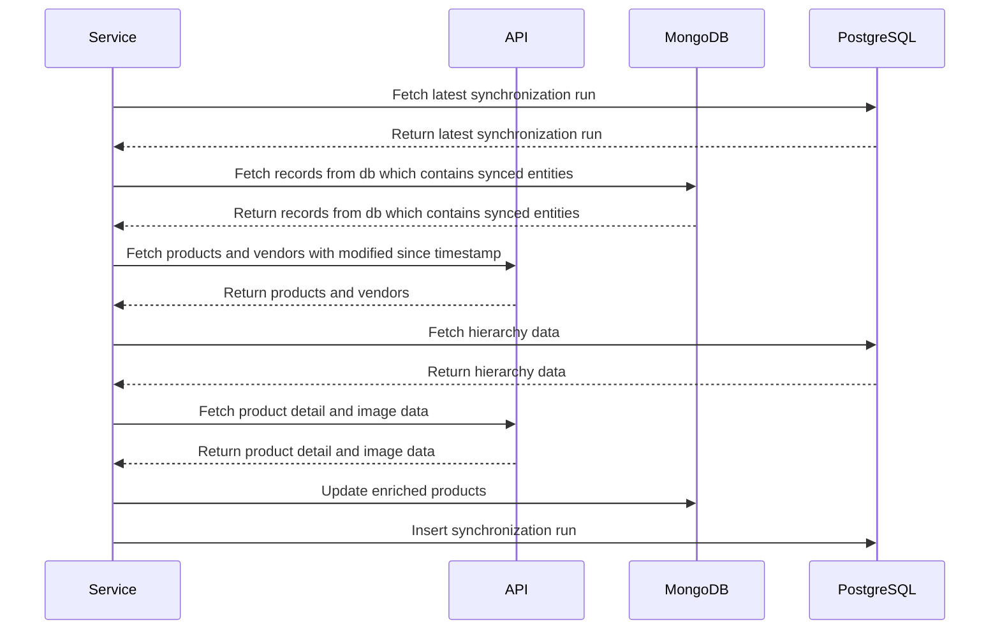

# Data Synchronization Service
## Overview
This project is a Data Synchronization Service that keeps product and vendor information up-to-date between a REST API and a database. It's designed to ensure that our records always reflect the latest data from the remote source. This project showcases my ability to integrate different systems and manage data efficiently, which I believe are valuable skills for a position at Bosch Rexroth.

## How It Works (Concise Version)
1. Check Last Update: The service checks when the last synchronization was performed.
2. Fetch Data: It retrieves all products and vendors from the remote API and the local database.
3. Identify Changes: The service compares the data to identify any changes or new entries.
4. Update Records: It updates the local database with the latest information.
5. Save Sync Information: Finally, it logs the synchronization run for future reference.

## How It Works (Deep Dive Version)
1. **Check Last Update**
   The service starts by checking the last synchronization run. This is done by querying the SynchronizationRunsRepository to find the most recent synchronization timestamp. This timestamp is used to fetch only the data that has changed since the last run, optimizing the process by avoiding unnecessary data retrieval.
2. **Fetch Data**
   MongoDb: The service retrieves all enriched products from mongodb using the EnrichedProductRepository.
   PostgreSQL: Fetch the hierarchical parent child product relationship data 
   Fruitshop REST API: It fetches the latest products and vendors from the remote FruitShop API through the FruitShopRestClient.
3. **Identify Changes**
   - The service identifies any changes or new entries by comparing the fetched data:
   - Products and Vendors: It builds maps of products and vendors using their IDs for easy lookup and comparison.
   - Changed Vendors: The service detects any vendors that have changed by comparing the local and remote data. It uses a helper method getChangedVendors to find vendors whose details (name or self-link) have been updated.
   - Modified Products: It identifies products that have been modified since the last run by only fetching modified products from the Fruitshop API.
4. **Update Records**
   Enriched Products: For each modified or new product, the service creates or updates EnrichedProduct instances. It fetches additional details like images and product details from the remote API.
   Vendor Information: It updates the vendor information for each product to ensure that mongoDb has the latest vendor data.
5. **Save Sync Information**
   Save Products: The updated and new enriched products are saved back to mongoDb using the EnrichedProductRepository.
   Log Sync Run: The current synchronization run is logged in the SynchronizationRunsRepository to keep track of synchronization history and facilitate future sync operations.
   Key Components
   DataSynchronizer: The main component that performs the synchronization.
   FruitShopRestClient: Connects to the remote API to fetch product and vendor data.
   Repositories: Manage the local database records for products, vendors, and synchronization runs.

## Visual representation of the network calls

## Running the Service

To run the service, follow these steps:


### Clone the repository:
```
git clone https://github.com/yourusername/datasynchronization-service.git
cd datasynchronization-service
```
### Build the project:
```
mvn clean install
```
### Configure the application properties:

Update the src/main/resources/application.properties file with your database connection details.

### Run the application:
```
mvn spring-boot:run
```
## Conclusion
This project demonstrates my ability to develop a robust data synchronization service, handle large datasets, and ensure data integrity between different systems. I am excited about the opportunity to bring these skills to Bosch and contribute to innovative projects.
